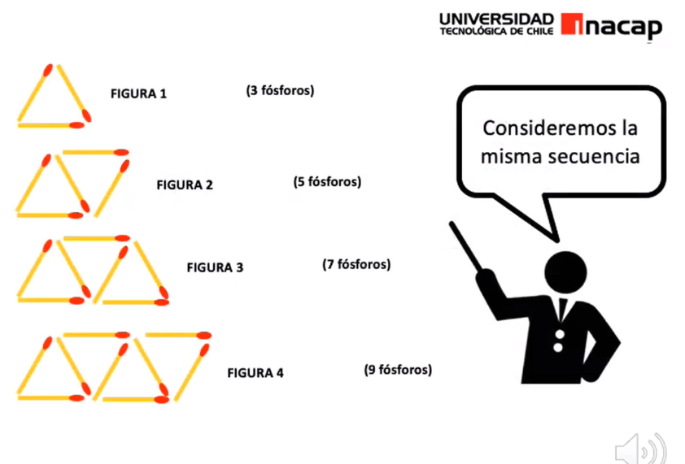

## Clase 2  Algebra  16-03-2021

1.- Construcciones con fosforos

---

**Pregunta 1: Cuantos fosforos tiene la figura 15**
* Figura 1 = 3 Fosforos
* Figura 2 = 5 Fosforos
* Figura 3 = 7 Fosforos
* Figura 4 = 9 Fosforos
* **`Figura N = N * 2 + 1`**
---
**Pregunta 2: Cuantos Fosforos tiene la figura 0**

Inervalo de 2 fosforos por figura

* Figura 0 = 0 * 2 + 1
---
**Pregunta 3: Cuantos Fosforos tiene la figura 235**

| Figura | Fosforos |
| ------ | -------- |
| 1      | 3        |
| 2      | 5        |
| 3      | 7        |
| 4      | 9        |
| 15     | 31       |
| 235    | 471      |
