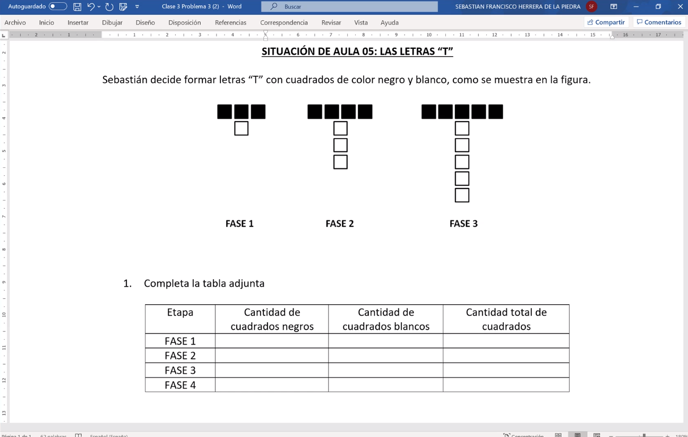
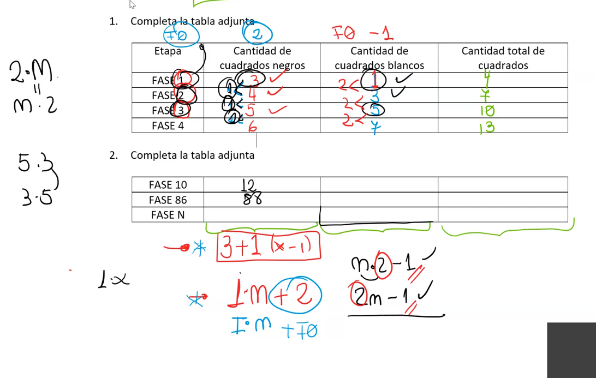

## Clase 3  Algebra  22-03-2021

**1.- Situacion de aulta 05, Letras T**

  
Imagen

---

**Tabla 1: Completar tabla 1**
| Etapa/Fase | Cuadros Negros | Cuadros Blancos | Total Cuadros |
| ---------- | -------------- | --------------- | ------------- |
| 0          | 2              | -1              | 1             |
| 1          | 3              | 1               | 4             |
| 2          | 4              | 3               | 7             |
| 3          | 5              | 5               | 10            |
| 4          | 6              | 7               | 13            |

  

**Tabla 2: Determinar la formula**
| Etapa/Fase | Cuadros Negros | Cuadros Blancos | Total Cuadros |
| ---------- | -------------- | --------------- | ------------- |
| 10         | 12             | 19              | 31            |
| 86         | 88             | 171             | 259           |
| N          | N + 2          | 2N - 1          | 3N + 1        |

  
Notas Profesor

  
Formula Profesor

---
 

**2.- Situacion de aulta 05, Letras T**

  
Imagen

**Tabla 1: Determinar Cuotas**
| Cuota | 10$    | 50$    | 100$   | Tot.Monedas | Total M. $10   | T. M $50      | T.M $100       | Total Dinero  |
| ----- | ------ | ------ | ------ | ----------- | -------------- | ------------- | -------------- | ------------- |
| 0     | 1      | -2     | 2      | 1           | 10             | -100          | 200            | $110          |
| 1     | 4      | 2      | 2      | 8           | 40             | 100           | 200            | $340          |
| 2     | 7      | 6      | 2      | 15          | 70             | 300           | 200            | $570          |
| 3     | 10     | 10     | 2      | 22          | 100            | 500           | 200            | $800          |
| 4     | 13     | 14     | 2      | 29          | 130            | 700           | 200            | $1030         |
| 10    | 31     | 38     | 2      | 71          | 310            | 1900          | 200            | $2410         |
| 48    | 145    | 190    | 2      | 337         | 1450           | 9500          | 200            | $11150        |
| N     | 3N + 1 | 4N - 2 | 0N + 2 | 7N + 1      | ( 3N + 1) * 10 | (4N - 2 )* 50 | (0N + 2) * 100 |               |
| N     | 3N + 1 | 4N - 2 | 0N + 2 | 7N + 1      | 10( 3N + 1)    | 50(4N - 2 )   | 100(0N + 2)    | 110 + N * 230 |